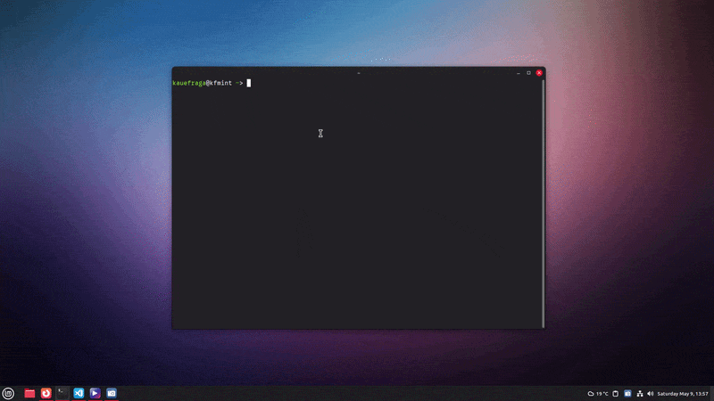
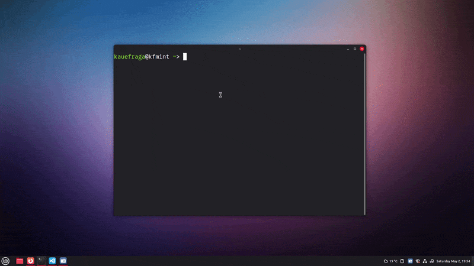

# Flexões Hoje 

Quantas flexões de braço você fez hoje? **Registre sem sair do terminal!**



## Começando

O `flexoeshoje` é uma ferramenta de registro para ajudar você com sua contagem de flexões. Com ela é possível registrar e exibir suas flexões com consistência e elegância.

```sh
# Veja quantas flexões você executou hoje
flexoeshoje registro

# Registre determinado número de flexões no dia de hoje
flexoeshoje adicionar 10

# Subtraia um número de flexões caso você precise
flexoeshoje subtrair 5
```

[Conheça mais sobre a CLI](#cli)

## Instalação

1. Entre na [página de releases](https://github.com/kauefraga/flexoeshoje-cli/releases/latest)
2. Instale o binário compatível com a sua plataforma (exemplo: `flexoeshoje.exe` para Windows)
3. Pronto! Comece já a registrar quantas vezes você empurrou a Terra para baixo!

###### Instalação pelo terminal

<details>

<summary>Linux</summary>

```sh
curl -OL https://github.com/kauefraga/flexoeshoje-cli/releases/latest/download/flexoeshoje
```

</details>

<details>

<summary>Windows</summary>

```sh
curl -OL https://github.com/kauefraga/flexoeshoje-cli/releases/latest/download/flexoeshoje.exe
```

</details>

<details>

<summary>MacOS</summary>

```sh
curl -OL https://github.com/kauefraga/flexoeshoje-cli/releases/latest/download/flexoeshoje-darwin
```

</details>

Lembre-se de conceder permissão de execução ao binário e mover para um diretório que esteja no `PATH`.

## CLI

### Tudo sobre o comando `registro`

O comando `registro` mostra uma lista com todos os registros de flexão de braço feitos no dia de hoje e o total de execuções realizadas.

###### Anatomia

```sh
flexoeshoje registro
```

###### Aliases

```sh
# Aliases
flexoeshoje registro
flexoeshoje reg
flexoeshoje r
```

### Tudo sobre o comando `adicionar`

O comando `adicionar` registra suas flexões diárias.

###### Anatomia

```sh
flexoeshoje adicionar [numero-positivo]
```

###### Aliases

```sh
# Aliases
flexoeshoje adicionar
flexoeshoje add
flexoeshoje a
```

### Tudo sobre o comando `subtrair`

O comando `subtrair` remove flexões adicionadas incorretamente. Exemplo: você adicionou 50 flexões (`flexoeshoje adicionar 50`) mas realizou 30. Para corrigir você pode executar o comando `flexoeshoje subtrair 20` e pronto.

###### Anatomia

```sh
flexoeshoje subtrair [numero-positivo]
```

###### Aliases

```sh
# Aliases
flexoeshoje subtrair
flexoeshoje sub
flexoeshoje s
```

## Desenvolvimento

Ferramenta feita usando Cobra para construção da interface de linha de comando e SQLite como banco de dados local.

Para adição de mais flexões no mesmo dia foi implementada uma estratégia similar a um ["Ledger"](https://en.wikipedia.org/wiki/General_ledger), onde cada vez que o usuário informa novas repetições de flexão o sistema cria um novo registro, ao invés de atualizar apenas um. Com isso, existe um controle robusto das execuções.

O banco de dados SQLite foi escolhido pois oferece praticidade e máxima eficiência já que o banco se encontra na própria máquina, porém futuramente a ferramenta irá se integrar com a API do projeto, [flexoeshoje-api](https://github.com/kauefraga/flexoeshoje-api).

### v1.0.0



## Licença

Este projeto está sob a licença MIT - Veja a [LICENÇA](LICENSE) para mais informações.
